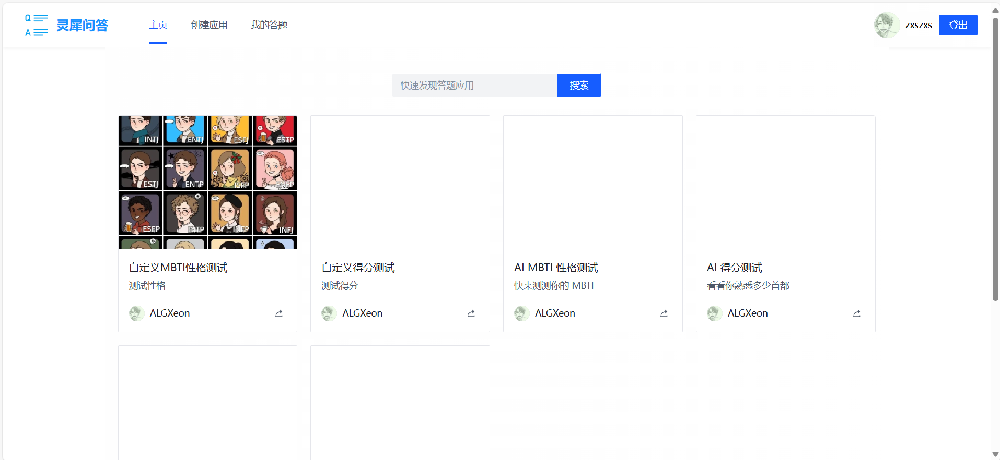
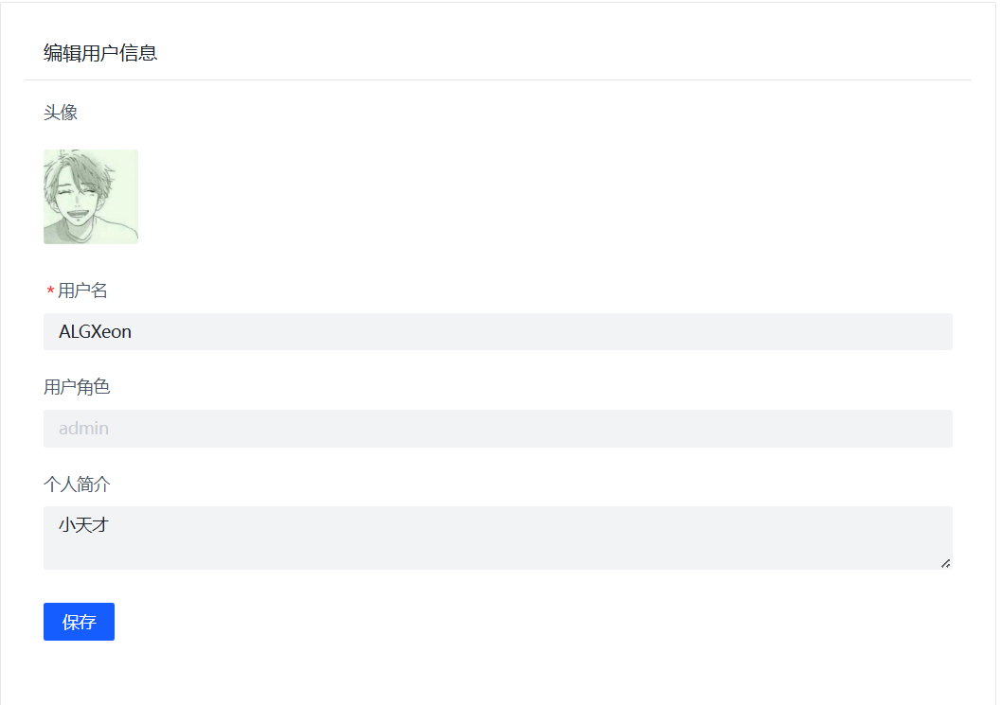

# 灵犀问答平台 ———— AI 答题应用平台

## 项目简介

灵犀问答平台是一个基于Spring Boot和Vue3构建的AI答题应用平台，允许用户自定义问题与答案，回答他人的问题，利用AI创建问题应用，并自动评价答题情况。我们的目标是提供一个高效、便捷且功能丰富的平台，满足从个人到企业的不同需求。

## 主要特性

- **AI辅助题目生成**：只需描述应用背景，AI即可为您生成相关题目及选项。
- **灵活的答题模式**：支持测评类与得分类两种答题模式。
- **高性能优化**：采用 **SSE（Server-Sent Events）、RxJava** 提高数据响应速度，实时推送AI创建的问题，提升用户体验。
- **分库分表设计**：支持大规模用户并发，提高数据库读写效率  
- **幂等性设计**：确保 API 调用的安全性和一致性，防止用户多次提交答题结果产生的问题。

## 技术选型

### 后端服务

- Java Spring Boot 开发框架（万用后端模板）
- 存储层：MySQL 数据库 + 腾讯云 COS 对象存储
- MyBatis-Plus 及 MyBatis X 自动生成
- Redisson 分布式锁
- Caffeine 本地缓存
- ⭐️ 基于 ChatGLM 大模型的通用 AI 能力
- ⭐️ RxJava 响应式框架 + 线程池隔离
- ⭐️ SSE 服务端推送
- ⭐️ 分库分表
- ⭐️ 幂等设计 + 分布式 ID 雪花算法
- ⭐️ 多种设计模式，如策略模式

## 前端界面

- **Vue3 + TypeScript**：现代化前端框架，提升开发效率与性能。
- **Arco Design**：UI组件库，确保界面的一致性与美观度。
- **Pinia**：状态管理库，简化全局状态管理。
- **Axios**：HTTP请求库，与后端进行数据交互。
- **ESLint + Prettier**：前端工程化
- **OpenAPI** ：前端代码自动生成

## 架构设计

### 业务流程图

### 架构设计图

## 界面展示

**主页**  

**应用页面**

**创建应用**

**AI创建题目**  

**登录页面**  

**用户详情页面**  

## 贡献代码

我们非常欢迎任何形式的贡献，包括但不限于：

- 提交Bug修复
- 新功能建议与实现
- 文档改进
